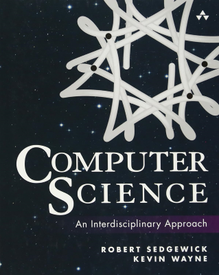

<h1 align="center">Computer Science</h1>

     
    
     

 

    
    
    
    

## Resources

- [Computer Science, 1st Edition](https://introcs.cs.princeton.edu/java/home/)
- [Java SE 17 & JDK 17 API Specification](https://docs.oracle.com/en/java/javase/17/docs/api/index.html)

## Roadmap

- [ ] [Chapter 5: Theory of Computing](https://introcs.cs.princeton.edu/java/50theory)
- [ ] [Chapter 6: A Computing Machine](https://introcs.cs.princeton.edu/java/60machine)
- [ ] [Chapter 7: Building a Computer](https://introcs.cs.princeton.edu/java/70circuits)

## License

This project is released under the [MIT License](./LICENSE.md).