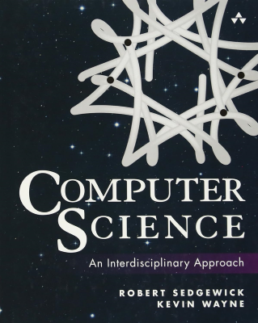

<h1 align="center">Computer Science</h1>

     
    
     

 

    
    
    
    

## About

Exploring core ideas of Turing, von Neumann, Shannon, and other important figures in computer science.

Textbook coauthored by [Robert Sedgewick](https://www.cs.princeton.edu/people/profile/rs) and [Kevin Wayne](https://www.cs.princeton.edu/people/profile/wayne) at Princeton University.

## Documentation

### Princeton

- [Computer Science, 1st Edition (Princeton)](https://introcs.cs.princeton.edu/java/home/)

### External Links

- [JDK 21 Documentation (Oracle)](https://docs.oracle.com/en/java/javase/21/)

## Roadmap

### Prerequisites

- [ ] [Introduction to Programming in Java (GitHub)](https://github.com/kserbouty/programming-java)

### Textbook

- [ ] [Chapter 5: Theory of Computing](https://introcs.cs.princeton.edu/java/50theory)
- [ ] [Chapter 6: A Computing Machine](https://introcs.cs.princeton.edu/java/60machine)
- [ ] [Chapter 7: Building a Computer](https://introcs.cs.princeton.edu/java/70circuits)

## License

This project is released under the [MIT License](./LICENSE.md).
